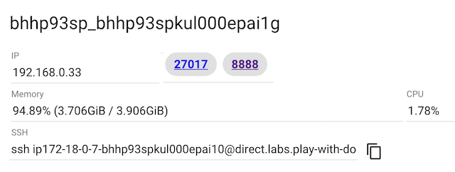

## Creating the main server

This starts a jupyter notebook server with the emission modules loaded,
connected to a database.

[](https://labs.play-with-docker.com/?stack=https://raw.githubusercontent.com/e-mission/e-mission-docker/master/examples/juypter-notebook/docker-compose-small.yml)

#### Getting the token when running in PWD
Note that PWD launches the stack in the background, so you cannot see the logs, which means that you cannot find the token to connect to the notebook. So you need to use the terminal to get the token. Here's an example of how to do that

Find the container id for the notebook server (`d82e23a7ac74` in this case)
```
$ docker container list
CONTAINER ID        IMAGE                                       COMMAND                  CREATED             STATUS              PORTS                NAMES
d82e23a7ac74        emission/e-mission-server:notebook-latest   "/usr/bin/tini -- /b…"   16 minutes ago      Up 16 minutes       8080/tcp, 8888/tcp   pwd_web-server.1.ls976x71njfr2b15irgl844rd
f2288c6ceb5e        mongo:3.4                                   "docker-entrypoint.s…"   16 minutes ago      Up 16 minutes       27017/tcp            pwd_db.1.eadx22xqvqd62hvfx7mastie3
```

Connect to the container, activate the emission environment and list the notebooks

```
[node1] (local) root@192.168.0.33 ~
$ docker exec -it d82e23a7ac74 bash
(base) root@d82e23a7ac74:/usr/src/app# source activate emission
(emission) root@d82e23a7ac74:/usr/src/app# jupyter notebook list
Currently running servers:
http://0.0.0.0:8888/?token=1ea459c8d38cab23d743b08ceff20e3a9f29935756cac9ac :: /usr/src/app
(emission) root@d82e23a7ac74:/usr/src/app# exit
```

Use that token in the notebook server that you get when you click on the link to port `8888`



#### Getting the token when running on your own computer

The default `docker-compose.yml` is also an example of [tweaking the standard
image](../../README.md#tweaking-the-image). We copy over a startup file
(`start_notebook.sh`) that launches a juypter server instead of the standard
emission server. Because this is a tweaked image, [it requires an extra `build` step if the e-mission server image has changed](../../README.md#tweaking-the-image).

There are some special instructions for running this container.
1. **Do not use** the `-d` option. You want to be able to see the logs.

    ```
    docker-compose -f examples/juypter-notebook/docker-compose.yml up
    ```

1. When the container has finished launching, find these lines in the log
    ```
    web-server_1  |     Copy/paste this URL into your browser when you connect for the first time,
    web-server_1  |     to login with a token:
    web-server_1  |         http://0.0.0.0:8888/?token=<some_long_token>
    ```
1. Copy-paste that URL into the browser
    - Make sure to [change `localhost` to the correct
host IP for your operating system if needed](../../README.md#connecting-to-the-created-container)

1. Note that because of the way that docker works, all the notebooks created in the main e-mission-server directory are essentially **temporary**.
    - they will be **retained** when you kill (Ctrl+C) and restart (`up`)the containers.
    - they will be **deleted** when the container is removed (e.g. when you run `docker-compose down`).
      - If you want to preserve your notebooks across `up/down` sessions, store them in the **`saved-notebooks`** directory.

### Other options

Using `docker-compose-small.yml` generates a smaller, less optimized image, [without the `mkl` optimizations](https://docs.anaconda.com/mkl-optimizations/). This is the version that runs by default in PWD.

```
docker-compose -f examples/juypter-notebook/docker-compose-small.yml up
```

### Testing

The server is started on port 8888. 

- So on \*nix systems, this server is at http://localhost:8888
- For other operating systems, you may have to [use a different host than
  `localhost`](../../README.md#connecting-to-the-created-container)
